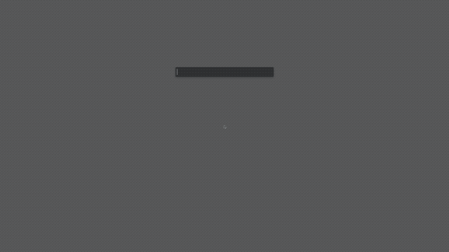

# HHTWM
## Hackable Hammerspoon Tiling WM

<p align="center">
  
</p>

HHTWM is a module for [Hammerspoon](http://www.hammerspoon.org) providing automatic layout-based tiling for macOS.

It's configurable, hackable, and composes well with other Hammerspoon libraries.

## Setup

1. install required dependency - [`hs._asm.undocumented.spaces`](https://github.com/asmagill/hs._asm.undocumented.spaces)
2. copy `hhtwm/` folder to `~/.hammerspoon/`
3. require the library in your `init.lua`:
  ```lua
  hhtwm = require('hhtwm') -- it's recommended to make `hhtwm` a global object so it's not garbage collected.
  ```

## MVP

Smallest `init.lua` that tiles by default (with no keybindings and no margins):

```lua
hhtwm = require('hhtwm')
hhtwm.start()
```

## Configuration

All settings are optional.

- `hhtwm.margin` - `[number]` - gap size between windows (in px)
- `hhtwm.screenMargin` - `[object]` (`{ top = 30, bottom = 5, left = 5, right = 5 }`) - gap size from screen edges
- `hhtwm.defaultLayout` - `[string]` - name of default layout to be applied
- `hhtwm.enabledLayouts` - `[array]` - list of enabled layouts, all layouts are enabled by default
- `hhtwm.displayLayouts` - `[object]` (`{ [leftScreenId] = "equal-right" }`) - per-screen default layouts
- `hhtwm.filters` - `[object]` - filters to force tiling on/off, example:
  ```lua
  hhtwm.filters = {
    { app = 'Finder', tile = false } -- don't tile Finder
    { app = 'Hammerspoon', title = 'Hammerspoon Console', tile = true } -- force tile Hammerspoon Console
  }
  ```
- `hhtwm.calcResizeStep` - `[function]` - function to calculate resize step, example:
  ```lua
  hhtwm.calcResizeStep = function(screen)
    return 1 / hs.grid.getGrid(screen).w -- make the resize step be the same as hs.grid size for given screen
  end
  ```

## API

### Module related

- `hhtwm.start()` - starts watching for window changes and tiles when needed
- `hhtwm.stop()` - stops `hhtwm` and stores current state in `hs.settings`, `hhtwm.start()` picks those settings up, so state can be persisted over reloads
- `hhtwm.tile()` - force tile, usually not needed
- `hhtwm.reset()` - reset `hhtwm` state, usually not needed

### Window related

- `hhtwm.swapInDirection(win, dir)` - swaps window in given direction if possible (direction: `"west", "south", "north", "east"`)
- `hhtwm.throwToScreen(win, dir)` - throws window to another screen in given direction
- `hhtwm.throwToScreenUsingSpaces(win, dir)` - same as above but uses `hs._asm.undocumented.spaces` api
- `hhtwm.throwToSpace(win, spaceIndex)` - throws window to space by given index
- `hhtwm.isFloating(win)` - test if window is tiling/floating, returns `true`/`false`
- `hhtwm.toggleFloat(win)` - toggles floating state of given window

### Layout related

- `hhtwm.setLayout(layout)` - sets layout for current space
- `hhtwm.getLayout()` - gets layout for current space (returns layout name)
- `hhtwm.getLayouts()` - returns list of available layouts (either `hhtwm.enabledLayouts` or all layouts from `hhtwm`)
- `hhtwm.resizeLayout(resizeOption)` - resizes layout by given option, right now some layouts allow `thinner`/`wider` options
- `hhtwm.equalizeLayout()` - resets the layout resize (usually to 50/50)

## Example config

[You can check out my usage of `hhtwm` in my dotfiles repo](https://github.com/szymonkaliski/Dotfiles/tree/master/Dotfiles/hammerspoon), although it might be over-engineered in places.

